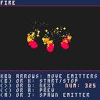
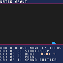
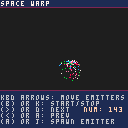
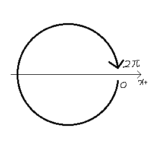
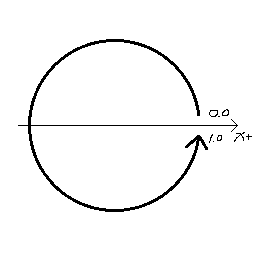

# beParticles

beParticles is a particle system implemented in pure Lua for [Bitty Engine](https://github.com/paladin-t/bitty/). It is ported from [MaxwellDexter/pico-ps](https://github.com/MaxwellDexter/pico-ps).

The idea is to port the original PICO-8 implementation to Bitty Engine in as few modification as possible, it is done with an extended Luax to regular Lua compiler and a compatibility layer. It makes it easy to synchronize with future version.

Try it out [in browser](https://paladin-t.github.io/beparticles/).

### Features

"beParticles" implements:

* Continuous emissions (default)
* Burst emissions
* Gravity
* Random colors
* Speed over lifetime and speed spread
* Life spread
* Angles and angle spread
* Size over lifetime and size spread
* Emission areas
* Color over life
* Sprite animation
* Random sprites
* Object Pooling

### Glance

Play [in browser](https://paladin-t.github.io/beparticles/).

### Usage

Setup:

1. Clone this repository or download from [releases](https://github.com/paladin-t/beparticles/releases)
2. Open "src" directly or import it to your own projects with [Bitty Engine](https://github.com/paladin-t/bitty/)
3. See code and comments for details

Code:

See [MaxwellDexter/pico-ps](https://github.com/MaxwellDexter/pico-ps) for details.

Note:

Bitty Engine uses the standard Lua coordinates where rotation angle starts from X+ and grows clockwise, with range of values from `0` to `2 * PI`.

beParticles (pico-ps) starts from X+ but grows anticlockwise, with range of values from `0.0` to `1.0`.

